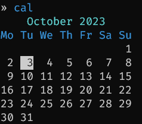
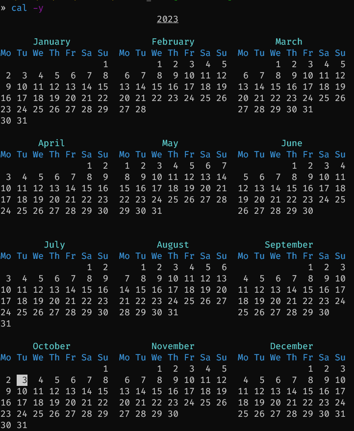

# cal - proleptic gregorian month calendar with coloring

This app tries to match `wsl ncal 10 2023 -b` output and was written as an excersize from the Command-Line Rust book. It doesn't follow the book solution though, but retains much of the tests (that were fixed to allows weeks that start on Monday, colorization and a different way to render the calendar).

## Installation

Separating the codebase into a standalone repository allows to install `cal` as a tool on any OS:

```ps1
cargo install -f --git https://github.com/FallenGameR/Calendar
```

## Usage

Month output `cal`:



Year output `cal -y`:



## Help

```text
» cal --help
Proleptic Gregorian month calendar with coloring

Usage: cal.exe [OPTIONS] [DATE]...

Options:
  -m, --month <MONTH>   Month NAME or number (1-12)
                        Ignored if DATE specifies month
  -y, --show_full_year  Show calendar for the whole year
  -C, --dont_use_color  Don't use color during output
  -h, --help            Print help
  -V, --version         Print version

DATE as [[month] year]:
  [DATE]...  Year number (99-9999) OR month and year
```
